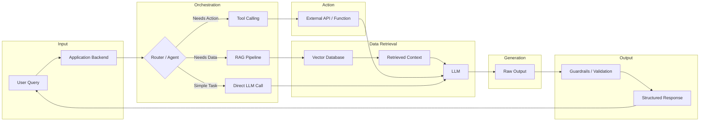

# The AI Engineering Reference

When I started transitioning from web development to AI engineering, I hit a massive wall. The AI space moves so fast that by the time a book is published, the tools it teaches are obsolete. Official documentation assumes you have a PhD in machine learning. And tutorials just show you how to pip install a library and print a hello world prompt, completely skipping why you would use it in a production application.

I needed a resource that treated AI engineering like software engineering. Not a math textbook, but a practical guide to building applications with Large Language Models. I could not find a single, structured place that explained everything from how tokens work, to building RAG systems, to deploying agents, all in one repository.

So, I built it. This folder is the AI engineering half of this repository. It is designed to take a competent software engineer and give them the exact mental models, architectural patterns, and vocabulary needed to build and interview for AI engineering roles.

## The Standard

Like the web development section, every topic here strictly follows a five-part structure to maximize retention:

- Definition: What the concept is in plain English.
- Analogy: A real-world comparison so the concept sticks.
- Code: Minimal Python code showing the implementation.
- Interview Questions: Scenario-based questions asked by companies building AI products.
- References: Links to official documentation.

## The AI Engineering Stack

AI engineering is not about training models. It is about orchestrating existing models, managing data, and building reliable software around non-deterministic outputs. This is the flow you must understand.

## Folder Map

### I. Prerequisites

- 00-AI-ROADMAP.md - The learning path, dependencies, and weekly schedule.
- 01-FOUNDATIONS-TRANSFORMERS-AND-RLM.md - Transformers, tokens, embeddings, vector math, attention query/key/value, autoregressive generation, and Recursive Language Models (RLMs).

### II. Core Application Building

- 02-CONTEXT-ENGINEERING-AND-STRUCTURED-OUTPUTS.md - System prompts, few-shot prompts, Chain of Thought, Pydantic validation, and the instructor library.
- 03-VECTOR-DATABASES-AND-GRAPH-RAG.md - Storing data for AI, chunking, similarity search, pgvector, Pinecone, and GraphRAG architectures.
- 04-ADVANCED-RAG-ARCHITECTURE.md - The advanced retrieval pipeline. Query transformation (HyDE), diversity routing (MMR), cross-encoder reranking, and agentic retrieval.

### III. Frameworks and Orchestration

- 05-LLAMAINDEX-DEEP-DIVE.md - Data connectors, ingestion pipelines, query engines, routers, and event-driven workflows.
- 06-LANGCHAIN-LANGGRAPH-AND-AGENT-FRAMEWORKS.md - LCEL expression language, tool calling loops, LangGraph state graphs, Google ADK, and CrewAI.
- 07-MULTIMODAL-AND-VOICE-AI.md - Vision language models (VLMs), real-time streaming, WebRTC integrations, and voice audio services.

### IV. Model Customization

- 08-FINE-TUNING-PEFT-AND-SLMS.md - Fine-tuning guidelines, parameter-efficient adaptations (LoRA, QLoRA), Hugging Face training tools, and edge Small Language Models (SLMs).

### V. Production and Safety

- 09-AI-INFRASTRUCTURE-DEPLOYMENT-AND-GATEWAYS.md - Quantization mechanics, high-throughput engines (vLLM, SGLang), API proxy gateways (LiteLLM), and FastAPI streaming endpoints.
- 10-SECURITY-GUARDRAILS-AND-OBSERVABILITY.md - Prompt injection defense, Presidio PII masks, NeMo guardrail layers, LangSmith/Langfuse observability tracing.

### VI. Interview Execution

- 11-AI-SCENARIO-QUESTIONS.md - 100+ real interview scenarios with expected engineering solutions.

## How to Use This Folder

1. Do not start here if you do not know Python basics. Learn Python first.
2. Read 01-FOUNDATIONS-TRANSFORMERS-AND-RLM until you understand what an embedding and a token are. Nothing else makes sense without this.
3. Move to 02-CONTEXT-ENGINEERING and 03-VECTOR-DATABASES. Build a basic script that embeds text and searches it.
4. Learn 04-ADVANCED-RAG to connect the database to the LLM.
5. Only then look at 05-LLAMAINDEX and 06-LANGCHAIN-LANGGRAPH. Frameworks make no sense if you don't know what they are abstracting away.

## Target Audience

- Software Engineers pivoting to AI roles.
- Full-Stack Developers adding AI features to their web applications.
- Junior AI/ML Engineers needing a structured reference for system design and interview prep.

## Contributing

The same strict rules apply here. Every topic must have Definition, Analogy, Code, Interview Questions, and References. Keep the explanations practical and code-focused.

## License

MIT
