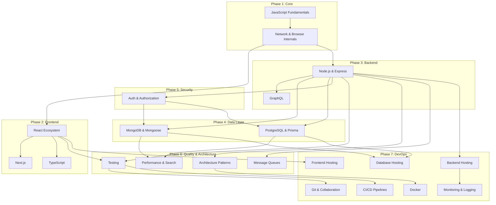

# The Full-Stack Web Development Reference

Over the years, I found myself bookmarking hundreds of articles, digging through outdated documentation, and scrolling endlessly just to find a concise explanation of how the Node.js event loop actually processes microtasks, or how to properly structure a Prisma schema for a many-to-many relationship.

Every resource I found was either too beginner-focused, too academic, or scattered across a dozen different platforms. I wanted a single, strictly structured place where any MERN or PERN stack concept could be looked up in minutes. I could not find it, so I built it.

This repository is a distilled, no-fluff reference guide for modern web development. It is designed to serve as the definitive mental index for developers preparing for technical interviews or architecting production applications.

## The Standard

To ensure consistency and maximum retention, every single topic in this repository strictly follows this five-part structure:

- Definition: What the concept is in plain English.
- Analogy: A real-world comparison so the concept sticks in your memory.
- Code: Minimal, syntactically correct code demonstrating the implementation.
- Interview Questions: The exact scenario-based questions asked by companies today.
- References: Direct links to official documentation for deep dives.

## Architecture Flow

This repository is structured sequentially, building from foundational knowledge to advanced architecture and deployment.

## Repository Map

### I. Core Fundamentals

- 00-ROADMAP.md - The complete revision path, topic dependencies, and weekly schedule.
- 01-JAVASCRIPT-FUNDAMENTALS.md - Event loop, closures, prototypes, async JS, ES6+.
- 02-NETWORK-AND-BROWSER-INTERNALS.md - DNS, TCP/IP, HTTP versions, critical rendering path, V8 engine.

### II. Frontend Engineering

- 03-REACT.md - Hooks, state management, React Query, performance optimization.
- 04-NEXT-JS.md - App router, server components, SSR/SSG/ISR, server actions.
- 05-TYPESCRIPT.md - Generics, utility types, type narrowing, TS integration with React and Node.

### III. Backend Engineering

- 06-NODE-JS-AND-EXPRESS.md - Streams, worker threads, middleware, error handling, Socket.io.
- 07-GRAPHQL.md - Schemas, resolvers, Apollo Server/Client, DataLoader.

### IV. Data Layer

- 08-MONGODB-AND-MONGOOSE.md - Aggregation pipelines, indexing strategies, schema design, populate.
- 09-POSTGRESQL-AND-PRISMA.md - Window functions, CTEs, Prisma relations, migration workflows.

### V. Security

- 10-AUTHENTICATION-AND-AUTHORIZATION.md - JWT flows, OAuth, passkeys, RBAC, XSS/CSRF/SQLi prevention.

### VI. Quality & Architecture

- 11-TESTING.md - Jest, Vitest, React Testing Library, Supertest, Playwright, MSW.
- 12-ARCHITECTURE-PATTERNS.md - MVC, repository pattern, clean architecture, SOLID principles.
- 13-PERFORMANCE-OPTIMIZATION.md - N+1 queries, indexing strategy, caching layers, Core Web Vitals.
- 14-SEARCH.md - Postgres full-text, pgvector, Elasticsearch basics, Algolia.
- 15-MESSAGE-QUEUES-AND-BACKGROUND-JOBS.md - BullMQ, dead letter queues, Redis as a broker.

### VII. DevOps & Deployment

- 16-VERSION-CONTROL-AND-COLLABORATION.md - Git flow, conventional commits, semantic versioning.
- 17-DOCKER-AND-CONTAINERIZATION.md - Dockerfiles, multi-stage builds, compose, networking.
- 18-CI-CD-PIPELINES.md - GitHub Actions, lint/test/build/deploy stages, caching, secrets.
- 19-FRONTEND-DEPLOYMENT.md - Vercel, Netlify, Cloudflare Pages, CDN configuration.
- 20-BACKEND-DEPLOYMENT.md - Railway, Render, AWS EC2, Nginx reverse proxy, PM2.
- 21-DATABASE-HOSTING.md - MongoDB Atlas, Supabase, Neon, RDS, connection pooling.
- 22-MONITORING-AND-LOGGING.md - Winston, Morgan, Sentry, health checks, uptime monitoring.

### VIII. Interview Execution

- 23-SCENARIO-BASED-INTERVIEW-QUESTIONS.md - 100+ real interview scenarios with expected approaches.
- 24-CHEAT-SHEETS.md - Quick reference commands for Git, Docker, MongoDB, SQL, React, and HTTP.
- 25-PROJECT-IDEAS.md - 10 production-grade project ideas mapped directly to these concepts.

## How to Use This Repository

Do not read this top to bottom like a textbook. It is an index.

1. Identify your weak areas using the 00-ROADMAP.md.
2. Navigate to the specific markdown file.
3. Read the Definition and Analogy to trigger your memory.
4. Review the Code snippet to confirm syntax.
5. Test yourself against the Interview Questions at the end of the section.
6. If a concept still feels unclear, click the Reference link and read the official documentation.

## Target Audience

- Mid-Level to Senior Developers preparing for full-stack system design and coding interviews.
- Self-Taught Engineers looking to fill structural gaps in their computer science knowledge.
- Lead Developers wanting a standardized resource to onboard junior engineers to the MERN/PERN stack.

## Contributing

If you find an outdated concept, a broken link, or want to add a scenario-based question you faced in a technical interview, open a pull request.

To maintain the integrity of this resource, all contributions must adhere to the following formatting rules:

- Every topic must strictly follow the five-part structure: Definition, Analogy, Code, Interview Questions, References.
- Definitions must be written in plain English. A beginner should be able to understand them.
- Code examples must be minimal, syntactically correct, and runnable.

## License

MIT
